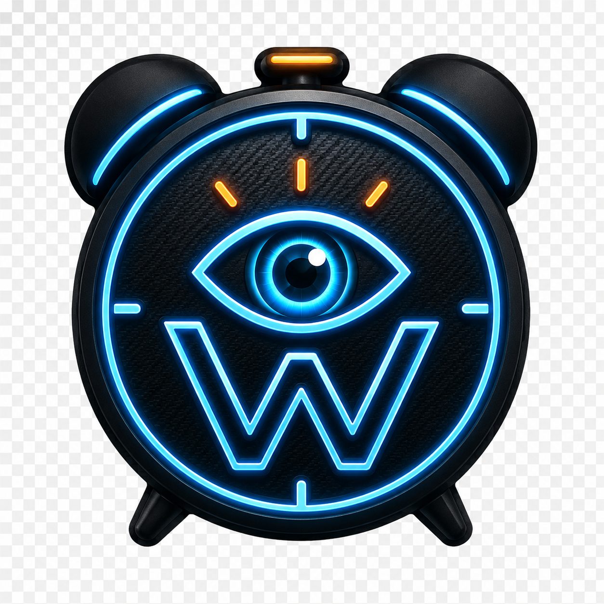

# 👁️ WakeUpMan

**WakeUpMan** é um sentinela de segurança inteligente projetado para prevenir acidentes causados por sonolência e fadiga. Utilizando visão computacional avançada em tempo real, o aplicativo monitora sinais vitais de atenção e dispara alertas agressivos para manter você acordado.

---

## 🚀 Proposta de Valor

Diferente de soluções comuns, o **WakeUpMan** foca na **agressividade do alerta** e na **resiliência do sistema**. Ele foi construído para funcionar em condições críticas, mesmo com a tela bloqueada ou com outros aplicativos (como o Google Maps) em primeiro plano.

### 🎯 Principais Recursos

- **🧠 Inteligência Artificial On-Device:** Utiliza Google ML Kit para processar `eyeOpenProbability` e orientação da cabeça em 3D sem enviar dados para a nuvem (Privacidade Total).
- **🛡️ Monitoramento Implacável:** Serviço em segundo plano (`Foreground Service`) de alta prioridade que resiste às otimizações agressivas de bateria do Android.
- **🚨 Alerta Multi-Sensorial:**
  - Áudio de alta intensidade com bypass de "Não Perturbe".
  - Flash LED Strobe para despertar visual imediato.
  - Padrões de vibração de emergência.
- **🇧🇷 Internacionalização:** Suporte completo para Português (Brasil) e Inglês.
- **📱 Compatibilidade Samsung:** Lógica proativa de Intents testada em dispositivos da linha S24/S25/S26.

---

## 🛠️ Stack Tecnológica

- **Linguagem:** Kotlin
- **UI:** Jetpack Compose (Material 3 - Industrial Safety Theme)
- **IA/ML:** Google ML Kit Face Detection
- **Câmera:** CameraX (Headless implementation)
- **Database:** Room (Log de Incidentes)
- **DI:** Hilt (Dagger)
- **Arquitetura:** Clean Architecture + MVVM

---

## 📸 Screenshots

| Onboarding & Setup | Dashboard Ativo | Alerta Crítico |
|:---:|:---:|:---:|
|  | *Dashboard Preview* | *Alert Screen Preview* |

---

## 📥 Instalação

1. Baixe o [APK de Release mais recente](https://github.com/renanrn/wakeupman/releases).
2. Conceda as permissões de **Câmera** e **Notificação**.
3. **Crítico:** Siga o guia interno para definir a Otimização de Bateria como **"Sem Restrições"**. Sem isso, o Android pode encerrar o sentinela.

---

## ⚠️ Isenção de Responsabilidade (Disclaimer)

O **WakeUpMan** é uma ferramenta de auxílio à segurança e **não substitui o descanso adequado**. Se você se sente cansado enquanto dirige ou trabalha, a única solução 100% segura é parar e dormir. Os desenvolvedores não se responsabilizam por acidentes, falhas de hardware ou falsos negativos do sistema de IA. **Sua vida é sua prioridade.**

---

## 🤝 Contribuição

Contribuições são bem-vindas! Sinta-se à vontade para abrir Issues ou enviar Pull Requests.

1. Faça um Fork do projeto.
2. Crie uma branch para sua feature (`git checkout -b feature/NovaFeature`).
3. Comite suas mudanças.
4. Faça o Push para a branch (`git push origin feature/NovaFeature`).
5. Abra um Pull Request.

---

## 📄 Licença

Distribuído sob a licença MIT. Veja `LICENSE` para mais informações.

---
**Desenvolvido com 🤖 e ❤️ para salvar vidas.**
