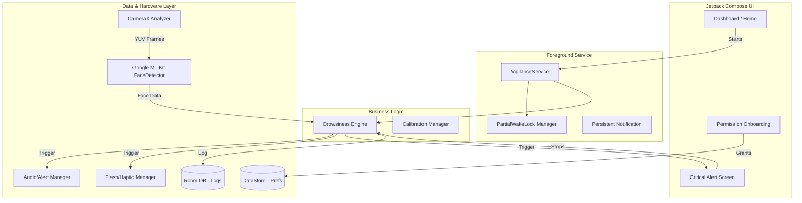

# WakeUpMan Architecture Document

## 1. Introduction
This document outlines the system architecture for **WakeUpMan**, an Android application designed to monitor drowsiness signs in real-time and alert the user. It serves as the single source of truth for the development, addressing the critical challenges of maintaining background execution on modern Android systems (API 34+) and low-latency computer vision processing.

## 2. High-Level Architecture

### Technical Summary
WakeUpMan follows a native Android **Clean Architecture** combined with the **MVVM** pattern for the presentation layer. The core of the app runs in a decoupled **Foreground Service** to ensure continuous camera access and background execution. It leverages **CameraX** for frame capture and **Google ML Kit** for on-device face detection, applying custom logic to determine fatigue states. The alert system interfaces directly with Android hardware APIs (AudioManager, CameraManager/Flash, Vibrator) to bypass Do Not Disturb restrictions in emergencies.

### Architecture Diagram


## 3. Technology Stack

| Category | Technology | Version / Target | Purpose |
|----------|------------|------------------|---------|
| Platform | Android Native | API 34 (Android 14) | Ensures full access to Foreground Services and hardware APIs. |
| Language | Kotlin | 1.9+ | Modern, safe, and recommended for native Android. |
| UI Framework | Jetpack Compose | Latest | Declarative UI, essential for fast iteration and dynamic states. |
| Camera | CameraX | 1.3+ | Abstracts camera lifecycle, provides `ImageAnalysis` use case. |
| ML/Vision | Google ML Kit | Latest Face Detection | Fast, on-device face/eye tracking without network dependency. |
| Asynchrony | Coroutines & Flow | Latest | Handles asynchronous ML processing and reactive state streams. |
| Local Data | Room & DataStore | Latest | Persistent incident logging (Room) and settings (DataStore). |
| Dependency Inj. | Hilt / Dagger | Latest | Decouples components and makes the engine testable. |

## 4. Core Components & Strategy

### 4.1. Foreground Execution & Resilience
To maintain the app running in the background while the screen is off (Android 14+):
- **Service Type:** `VigilanceService` must declare `foregroundServiceType="camera|specialUse"` in the manifest.
- **WakeLock:** A `PartialWakeLock` is acquired when monitoring starts to prevent the CPU from sleeping.
- **Battery Optimization Bypass:** The app will guide the user to whitelist the app from OEM-specific battery restrictions (Samsung, Xiaomi, etc.) via explicit Intents.

### 4.2. Image Processing Pipeline (Throttling)
To balance the `< 200ms` latency requirement (NFR2) with the `< 15% battery/hr` requirement (NFR4):
- **CameraX ImageAnalysis:** Captures frames natively in `YUV_420_888`.
- **Dynamic Framerate:** We will not process 30/60 FPS. The analyzer will sample at ~10-15 FPS. If no face is detected or if eyes are consistently open, the ML Kit processing rate drops to ~3-5 FPS. If signs of fatigue start appearing, the processing rate ramps back up.

### 4.3. Drowsiness Engine (Domain)
The engine maintains a sliding window of the last *N* seconds of data.
- **Alert Condition 1 (Eyes):** If `eyeOpenProbability` < 40% for > 2 consecutive seconds.
- **Alert Condition 2 (Head Nod):** If head Pitch drops abruptly (> 30 degrees delta in < 1 second).

### 4.4. Extreme Alert System
When the engine triggers a critical state:
- **Audio:** Uses `AudioManager.STREAM_ALARM` with `AudioAttributes.USAGE_ALARM` and bypasses DND policies using `android.permission.ACCESS_NOTIFICATION_POLICY`.
- **Screen:** Launches the `AlertActivity` using full-screen Intent with `FLAG_KEEP_SCREEN_ON` and `FLAG_TURN_SCREEN_ON` to wake the display.
- **Hardware:** Triggers the camera strobe via `CameraManager.setTorchMode()` and severe vibration patterns.

## 5. Security & Privacy
- **100% Offline:** Images are processed in RAM and discarded instantly. No network calls for AI.
- **Data Retention:** Only anonymous incident logs (timestamp, trigger type) are saved locally to Room for user review.

## 6. Repository Structure
```text
wakeupman/
├── app/
│   ├── src/main/
│   │   ├── AndroidManifest.xml
│   │   ├── java/com/wakeupman/
│   │   │   ├── core/           # DI, Base classes, Extensions
│   │   │   ├── data/           # Repositories, Room DB, DataStore, CameraX wrapper
│   │   │   ├── domain/         # DrowsinessEngine, Models, Interfaces
│   │   │   ├── service/        # VigilanceService, Wakelock Manager, AlertManager
│   │   │   └── ui/             # Jetpack Compose Screens, ViewModels, Theme
│   │   └── res/                # XML layouts (if any), Drawables, Values
│   └── build.gradle.kts
├── build.gradle.kts
└── settings.gradle.kts
```

## 7. Next Steps & Development Phases
1. **Epic 1:** Setup the project skeleton, Hilt, and the `VigilanceService` with basic CameraX.
2. **Epic 2:** Integrate ML Kit into the `ImageAnalysis` use case and implement the `DrowsinessEngine`.
3. **Epic 3:** Connect the `AlertManager` (Audio, Flash, Vibration) to engine triggers.
4. **Epic 4:** Build the Compose UI for calibration, permission onboarding, and the critical alert screen.
